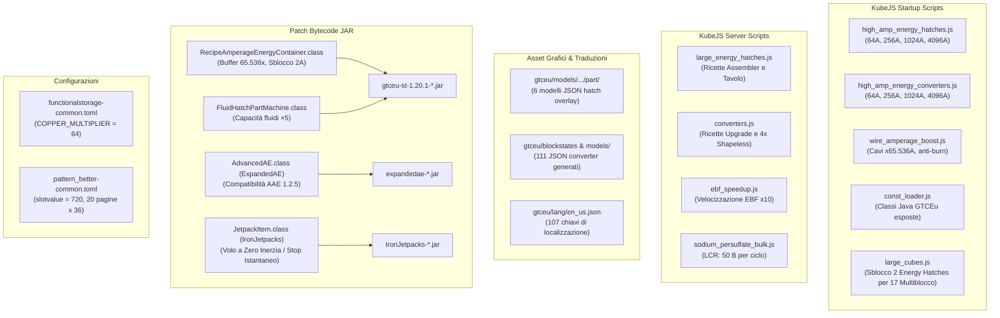

# Report Completo delle Modifiche Personalizzate - Star Technology

Questo documento raccoglie in modo esaustivo tutte le modifiche, aggiunte di contenuti, patch al motore di gioco e correzioni apportate all'istanza del modpack **Star Technology**. 

Lo scopo di questo report è garantire che, in caso di aggiornamento del modpack da Prism Launcher o CurseForge, sia possibile ripristinare integralmente tutte le funzionalità personalizzate in pochi secondi, sia in modo del tutto automatico tramite lo script dedicato, sia manualmente.

---

## Ultime modifiche (24 settembre 2026)

- **Fluid Input Hatch e Fluid Output Hatch GTCEu:** capacità di ciascun serbatoio moltiplicata per **5** in tutti i tier, per le versioni con 1, 4 e 9 serbatoi. Il valore vale sia per gli hatch di input sia per quelli di output. Esempio EV: l'hatch 4x passa da 250.000 a **1.250.000 mB per serbatoio**. La classe modificata è `gtceu_singleblock_energy_patch/com/gregtechceu/gtceu/common/machine/multiblock/part/FluidHatchPartMachine.class`; `apply_all_patches.py` la reinserisce nel JAR di GTCEu. Gli ME hatch usano la capacità della rete ME. Dettagli nella sezione L.
- **Sodium Persulfate:** nuova ricetta `start:sodium_persulfate_bulk` nel Large Chemical Reactor: 40 Sodium Dust, 40 Sulfur Dust e **16.000 mB di Oxygen** producono **50.000 mB di Sodium Persulfate** in 2.400 tick a tensione EV. Lo script è conservato in `backup_files/server_scripts/common/additions/progression/lines/sodium_persulfate_bulk.js`. Dettagli nella sezione N.
- **Tiab:** modalità per giocatore `Singola` (predefinita), `Area 3×3`, `Area 7×7` e `Shapeless` (massimo 64 blocchi). Shift + clic destro nel vuoto cambia modalità, senza dover guardare in alto. Shift + clic destro su qualsiasi blocco non cambia modalità. Lo script è conservato in `backup_files/server_scripts/tiab_modes.js`. Dettagli nella sezione O.

---

## 1. Mappa Riepilogativa delle Modifiche



---

## 2. Dettaglio di Ogni Modifica

### A. Energy Hatches ad Alto Amperaggio (64A, 256A, 1024A, 4096A)

* **Motivazione:** Nel modpack base esistevano hatch solo fino a 16A per l'EV. Per alimentare macchinari e multiblock ad alto consumo (o accelerati), servivano portate di corrente molto maggiori.
* **Oggetti aggiunti:**
  * **64A Energy Input Hatch** e **64A Dynamo Hatch**: HV, EV, IV, LuV, ZPM, UV, UHV, UEV, UIV, UXV, OpV, MAX.
  * **256A Energy Input Hatch** e **256A Dynamo Hatch**: EV, IV, LuV, ZPM, UV, UHV, UEV, UIV, UXV, OpV, MAX.
  * **1024A Energy Input Hatch** e **1024A Dynamo Hatch**: EV, IV, LuV, ZPM, UV, UHV, UEV, UIV, UXV, OpV, MAX.
  * **4096A Energy Input Hatch** e **4096A Dynamo Hatch**: EV, IV, LuV, ZPM, UV, UHV, UEV, UIV, UXV, OpV, MAX.
* **Caratteristiche tecniche:**
  * Capacità interna calcolata nativamente tramite `$EnergyHatchPartMachine.getHatchEnergyCapacity(tier, amperage)`.
  * Registrati con le abilità multiblock `PartAbility.INPUT_ENERGY`, `INPUT_ENERGY_16A`, `INPUT_ENERGY_4A`, `INPUT_ENERGY_2A` (e corrispettivi `OUTPUT_ENERGY`), rendendoli compatibili al 100% con qualsiasi multiblock GregTech (EBF, LCR, Processing Array, Large Cubes, ecc.).
* **File sorgente:**
  * Registrazione blocchi: `kubejs/startup_scripts/common/machines/high_amp_energy_hatches.js`
  * Ricette: `kubejs/server_scripts/additions/machines_and_parts/tiered_machines/large_energy_hatches.js`
  * Overlay grafici: `kubejs/assets/gtceu/models/block/machine/part/energy_{input|output}_hatch_{256a|1024a|4096a}.json`

---

### B. Energy Converters ad Alto Amperaggio (FE ↔ EU)

* **Motivazione:** Permettere la conversione istantanea di grandi quantità di energia Forge Energy (FE) in GregTech EU per sostenere i nuovi Energy Hatch e la rete elettrica.
* **Oggetti aggiunti:**
  * **64A Energy Converter**: tier HV (EV fino a MAX erano già forniti da `start_core`).
  * **256A Energy Converter**: tutti i tier da HV a MAX.
  * **1024A Energy Converter**: tutti i tier da HV a MAX.
  * **4096A Energy Converter**: tutti i tier da HV a MAX.
* **Caratteristiche tecniche:**
  * Istanza di `$ConverterMachine(holder, tier, amperage)`.
  * Tooltip dettagliati con calcolo automatico della conversione FE/EU in base al voltaggio del tier.
  * **Modalità FE → EU automatica:** Registrato l'evento `BlockEvents.placed` in KubeJS che imposta istantaneamente `{ energyContainer: { feToEu: true } }` al piazzamento del blocco nel mondo, eliminando la necessità di usare il cacciavite.
* **Ricette di Crafting:**
  1. **Progressione modulare (Assembler):** Scafo/Hatch precedente + fili superconduttori esadecimali + circuiti del rispettivo tier.
  2. **Ricette dirette:** Scafo macchina + fili superconduttori + circuiti.
  3. **Ricetta compatta 4:1 (Shapeless nel tavolo da lavoro):** 
     * 4x Converter 16A → 1x Converter 64A
     * 4x Converter 64A → 1x Converter 256A
     * 4x Converter 256A → 1x Converter 1024A
     * 4x Converter 1024A → 1x Converter 4096A
* **File sorgente:**
  * Registrazione macchine: `kubejs/startup_scripts/common/machines/high_amp_energy_converters.js`
  * Ricette e auto-FEtoEU: `kubejs/server_scripts/additions/machines_and_parts/converters.js`
  * Asset 3D e Blockstates: 111 file JSON generati dallo script `custom_patches/generate_converter_assets.py` in `kubejs/assets/gtceu/{blockstates,models/block/machine,models/item}/`.

---

### C. Potenziamento Cavi e Fili GregTech (Anti-Overheating)

* **Motivazione:** I cavi standard di GregTech bruciavano o fondevano se attraversati da più di 16A. Con converter e hatch da 64A, 256A, 1024A e 4096A, qualsiasi rete rischiava la distruzione.
* **Soluzione applicata:**
  * Script KubeJS su `GTCEuStartupEvents.materialModification`.
  * Itera tutti i materiali GregTech aventi la proprietà `PropertyKey.WIRE`.
  * Moltiplica l'amperaggio base per **65.536**:
    * Cavo 1x: **65.536 A**
    * Cavo 2x: **131.072 A**
    * Cavo 4x: **262.144 A**
    * Cavo 8x: **524.288 A**
    * Cavo 16x: **1.048.576 A**
  * Mantiene inalterate le tensioni nominali (un cavo LV esplode ancora se collegato a un generatore MV/HV per voltaggio errato, preservando la meccanica di gioco), ma supporta qualunque quantitativo di Ampere senza bruciare.
* **File sorgente:**
  * `kubejs/startup_scripts/common/elements_materials/material/wire_amperage_boost.js`

---

### D. Sblocco Buffer Energetico Macchinari a Singolo Blocco (Fix Time in a Bottle)

* **Problema riscontrato:** Se si accelerava un macchinario a singolo blocco (es. Maceratore, Centrifuga, Forno Elettrico) con la bottiglia temporale *Time in a Bottle* a 16x o 32x, la macchina andava in **"Insufficienza di energia"** e si bloccava, anche se collegata a un converter da 256A con cavi adeguati.
* **Causa tecnica nel codice Java di GregTech:**
  1. La classe `RecipeAmperageEnergyContainer` limitava dinamicamente `getInputAmperage()` a soli **2 Ampere massimi per tick** (`recipe.amperage() + 1`) durante l'esecuzione delle ricette.
  2. Il buffer interno standard memorizzava solo `64 * Voltaggio` EU (es. appena 125.440 EU in EV).
  3. Eseguendo 32 tick in uno solo, il macchinario richiedeva 32 pacchetti di energia, ma la rete ne poteva fornire solo 2 per tick: il buffer si svuotava in due cicli di clock.
* **Modifica Bytecode nel file JAR:**
  Nel file mod `mods/gtceu-st-1.20.1-1.7.1a.jar`:
  * `RecipeAmperageEnergyContainer.class`:
    * Buffer interno aumentato a `Voltaggio * 65.536L` (in EV: oltre **128 milioni di EU** di buffer!).
    * Rimosso il limite di 2A: `getInputAmperage()` accetta fino a **65.536 A per tick**.
  * *(Nota di stabilità: `NotifiableEnergyContainer.class` è mantenuta nella versione pulita ufficiale di GTCEu 1.7.1a per preservare la totale sincronia logica tra client e server).*
* **Backup delle classi pronte all'uso:**
  * `custom_patches/gtceu_singleblock_energy_patch/com/gregtechceu/gtceu/api/machine/trait/RecipeAmperageEnergyContainer.class`

---

### E. Correzioni Bug di Caricamento Script & Rimozione Packmode

* **Problema 1 (Scoping Rhino):** Un errore di scoping JavaScript Mozilla Rhino (`TypeError: redeclaration of var info.`) in `converters.js` interrompeva la catena di caricamento delle ricette al 21° script su 191. Oltre 170 script venivano saltati, facendo sparire da EMI la Clay Ball (`minecraft:clay_ball`), l'argilla nei barili, la setacciatura e i minerali del Void Miner.
  * **Risoluzione:** Riscrittura dei cicli in `converters.js` usando `forEach` e correzione della firma di `event.shaped` in `large_energy_hatches.js`. Risultato: **tutti gli script caricati con 0 errori**, 6.505 ricette registrate correttamente.
* **Problema 2 (Rimozione Hardmode in THETA 2):** Con l'aggiornamento a THETA 2, i modpack author hanno eliminato la mod `CraftTweaker`, `GameStages` e il sistema di modalità difficile (`global.not_hardmode`). Qualsiasi script contenente `global.not_hardmode(() => { ... })` andava in crash con `TypeError: Cannot find function not_hardmode`.
  * **Risoluzione:** Rimosso il wrapper `global.not_hardmode` da `converters.js` e da `large_energy_hatches.js`, rendendo la registrazione diretta e fully compatible.

---

### F. Velocizzazione Forno Elettrico ad Arco (EBF Speedup)

* **Funzionalità:** Riduce di un fattore 10 la durata di tutte le ricette dell'Electric Blast Furnace (EBF) registrate nel gioco.
* **File sorgente:**
  * `kubejs/server_scripts/common/modifications/ebf_speedup.js`

---

### G. Compatibilità Expanded AE & Advanced AE (Fix Crash NoSuchFieldError: SMALL_ADV_PATTERN_PROVIDER)

* **Problema riscontrato dopo l'aggiornamento a 1.20.1-THETA-2-HOTFIX-1:** 
  All'avvio del gioco, Minecraft crashava immediatamente durante la fase `FMLCommonSetupEvent` con errore:
  `java.lang.NoSuchFieldError: SMALL_ADV_PATTERN_PROVIDER at lu.kolja.expandedae.xmod.advancedae.AdvancedAE.<init>`.
* **Causa tecnica:**
  * L'aggiornamento del modpack ha sostituito `expandedae-1.4.1.b.jar` con `expandedae-1.4.2.e.jar`.
  * L'autore di Expanded AE ha compilato la versione 1.4.2.e facendo riferimento alla libreria `ae2addonlib` (`Lnet/pedroksl/ae2addonlib/registry/helpers/LibItemDefinition;`), introdotta nelle versioni non ancora stabili di Advanced AE.
  * Tuttavia, l'istanza utilizza `AdvancedAE-1.2.5-1.20.1.jar`, in cui i campi `SMALL_ADV_PATTERN_PROVIDER` e `ADV_PATTERN_PROVIDER` utilizzano i tipi originali `Lnet/pedroksl/advanced_ae/common/definitions/AAEItemDefinition;` e `AAEBlockDefinition;`.
  * Al caricamento della compatibilità opzionale, la JVM non trovava il descrittore del campo e interrompeva il gioco.
* **Soluzione applicata:**
  * Bytecode patch di `AdvancedAE.class` in `mods/expandedae-1.4.2.e.jar` con i descrittori di tipo nativi di Advanced AE 1.2.5.
  * La classe corretta è archiviata in `custom_patches/expandedae_patch/lu/kolja/expandedae/xmod/advancedae/AdvancedAE.class`.
  * Integrato lo step automatico al punto 5 di `apply_all_patches.py`.

---

### H. Configurazione Functional Storage (Fix COPPER_MULTIPLIER = 64)

* **Problema riscontrato con gli aggiornamenti:**
  Ad ogni aggiornamento del modpack, il file di configurazione `config/functionalstorage/functionalstorage-common.toml` viene sovrascritto dalla versione predefinita del modpack, reimpostando il parametro `COPPER_MULTIPLIER = 8` (invece di **64** impostato dall'utente), riducendo drasticamente la capienza dei cassetti (drawers) e sbilanciando lo stoccaggio.
* **Soluzione applicata:**
  * Il valore è mantenuto stabilmente a `COPPER_MULTIPLIER = 64` in [`config/functionalstorage/functionalstorage-common.toml`](file:///Users/angeloalbanesi/Library/Application%20Support/PrismLauncher/instances/Star%20Technology/minecraft/config/functionalstorage/functionalstorage-common.toml).
  * Il file di configurazione completo è memorizzato in `custom_patches/config/functionalstorage/functionalstorage-common.toml`.
  * Nello script di ripristino automatico [`apply_all_patches.py`](file:///Users/angeloalbanesi/Library/Application%20Support/PrismLauncher/instances/Star%20Technology/minecraft/custom_patches/apply_all_patches.py) (Passo 6), viene controllato il parametro: se un aggiornamento lo reimposta a un valore diverso (es. 8), lo script lo reimposta automaticamente a **64**.

---

### I. Sblocco dei 2 Energy Hatches per Tutti i Multiblocco Cubici (Large Cubes)

* **Problema riscontrato in THETA 2:**
  Tutti i 17 macchinari multiblocco cubici (Large Thermal Centrifuge, Large Macerator, Large Ore Washer, Large Chemical Bath, ecc.) hanno smesso improvvisamente di funzionare:
  1. I bus e gli energy hatch non assumevano la texture dell'involucro del multiblocco (rimanendo bianchi come i blocchi titanio EV o grigi come l'acciaio inox HV).
  2. Si sentiva il suono di lavoro continuo, ma inquadrando il macchinario con Jade la barra rossa di avanzamento della ricetta in secondi restava bloccata.
  3. Il controller diceva "Structure Formed".
* **Causa tecnica (Vincolo `{ exact: 1 }` 2A in THETA 2):**
  1. Nella versione precedente del modpack (pre-THETA 2), tutti i Large Cubes consentivano fino a 2 Energy Input Hatch tramite `Predicates.abilities(PartAbility.INPUT_ENERGY).setMinGlobalLimited(1).setMaxGlobalLimited(2)`.
  2. In THETA 2, i creatori del modpack hanno riscritto `kubejs/startup_scripts/machines/multiblocks/intermediate_multiblocks/large_cubes.js` imponendo un vincolo rigido:
     ```javascript
     P.ability(PA.euIn2a, { exact: 1 })
     ```
  3. Nel mondo dell'utente, tutti i multiblocco erano stati assemblati con **DUE Energy Hatch** (es. due hatch 256A EV posizionati alle altezze Y=56 e Y=57).
  4. A causa della restrizione `{ exact: 1 }`, il motore multiblock di GregTech rifiutava la struttura a runtime:
     * Il controller manteneva `isFormed: 1` salvato nei dati NBT del mondo (quindi la UI diceva ancora "Formed").
     * L'elenco interno delle parti collegate a runtime (`parts`) era però **vuoto**.
     * **Barra bloccata:** Non avendo alcun hatch energetico riconosciuto nel runtime, la ricetta richiedeva 7.680 EU/t ma non poteva attingere energia, restando bloccata in stato `WAITING` ("In attesa di energia").
     * **Colorazione slegata:** La funzione grafica `getFormedAppearance()` dei bus chiedeva al controller la texture, ma non trovando il collegamento attivo restituiva `null`, lasciando i bus bianchi/grigi con la loro texture grezza.
* **Soluzione applicata (Sblocco 1-2 Energy Hatch di qualsiasi capacità):**
  In [`kubejs/startup_scripts/machines/multiblocks/intermediate_multiblocks/large_cubes.js`](file:///Users/angeloalbanesi/Library/Application%20Support/PrismLauncher/instances/Star%20Technology/minecraft/kubejs/startup_scripts/machines/multiblocks/intermediate_multiblocks/large_cubes.js), il vincolo è stato ripristinato con:
  ```javascript
  P.ability(PA.euIn, { min: 1, max: 2, view: 1 })
  ```
  Questo consente a ciascuno dei 17 multiblocco di accettare **da 1 a 2 Energy Input Hatch** di qualsiasi amperaggio (inclusi 16A, 64A, 256A, 1024A, 4096A).
* **Tutti i 17 Multiblocco Cubici Coperti:**
  1. `Large Bender` (Involucro Birmabright)
  2. `Large Centrifuge` (Involucro Tumbaga)
  3. `Large Electrolyzer` (Involucro Duralumin)
  4. `Large Extruder` (Involucro Beryllium Aluminium Alloy)
  5. `Large Forming Press` (Involucro Elgiloy)
  6. `Large Lathe` (Involucro Beryllium Bronze)
  7. `Large Macerator` (Involucro Blue Steel)
  8. `Large Mixer` (Involucro Kovar)
  9. `Large Ore Washer` (Involucro Hydronalium)
  10. `Large Sifter` (Involucro Zamak)
  11. `Large Thermal Centrifuge` (Involucro Silicon Bronze)
  12. `Large Wiremill` (Involucro Sterling Silver)
  13. `Large Autoclave` (Involucro Silicone Rubber)
  14. `Large Pulverizer` (Involucro Galvanized Steel)
  15. `Large Arc Furnace` (Involucro Black Steel)
  16. `Large Electromagnetic Separator` (Involucro Manganin)
  17. `Large Rock Crusher` (Involucro Red Steel)
* **Persistenza:**
  Il file modificato è salvato in `custom_patches/backup_files/startup_scripts/machines/multiblocks/intermediate_multiblocks/large_cubes.js` e viene ripristinato automaticamente al Passo 1 di `apply_all_patches.py`.

---

### J. Configurazione ME Extended Pattern Provider (20 Pagine da 36 Pattern = 720 Slot)

* **Motivazione:** L'utente desiderava espandere la capienza dell'Extended Pattern Provider a 20 pagine (con 36 pattern a pagina, per un totale di 720 pattern) per gestire linee di crafting complesse senza dover moltiplicare i blocchi provider.
* **Funzionamento Tecnico:**
  * Nel modpack, la gestione delle pagine con 36 pattern a pagina per il **ME Extended Pattern Provider** (`expatternprovider`) è gestita dalla mod **Pattern Better** (`pattern_better-1.3.1-1.20.1.jar`).
  * Il numero complessivo di slot è regolato dalla proprietà `slotvalue` in [`config/pattern_better-common.toml`](file:///Users/angeloalbanesi/Library/Application%20Support/PrismLauncher/instances/Star%20Technology/minecraft/config/pattern_better-common.toml).
  * Con `slotvalue = 720`, il calcolo delle pagine (`(slotvalue + 36 - 1) / 36`) restituisce esattamente **20 pagine**.
  * L'interfaccia grafica abilita la navigazione completa tramite i pulsanti freccia e il box di salto pagina rapido per tutti i 720 slot.
* **Persistenza:**
  * File di configurazione impostato a `slotvalue = 720`.
  * Copia di backup archiviata in `custom_patches/config/pattern_better-common.toml`.
  * Integrato il Passo 7 in `apply_all_patches.py` per ripristinare e forzare automaticamente `slotvalue = 720` ad ogni aggiornamento.

---

### K. Parallel Control Hatches e Parallel Mastery Hatches

* **Motivazione:** Nel modpack base, i Parallel Control Hatch partivano solo da IV (4 paralleli), mancavano i tier HV ed EV, e molti multiblocchi intermedi e fondamentali (i 17 Large Cubes come il Large Mixer, l'Electric Blast Furnace e il Large Chemical Reactor) non supportavano la parallelizzazione tramite hatch. Inoltre, gli Absolute Parallel Mastery Hatches (a consumo energetico zero) erano vincolati al solo reattore a fusione endgame.
* **Modifiche Applicate:**
  1. **Sblocco Parallel Hatch su Tutti i 17 Large Cubes (incluso Large Mixer), Large Rock Crusher e Large Cutter (`super_cutter`):**
     * Aggiunto `GTRecipeModifiers.PARALLEL_HATCH` ai `.recipeModifiers(...)`.
     * Aggiunti `PartAbility.PARALLEL_HATCH` e `StarTPartAbility.ABSOLUTE_PARALLEL_HATCH` nel pattern dei casing (incluso l'involucro in bronzo al berillio del Large Cutter).
  2. **Sblocco Parallel Hatch su Electric Blast Furnace (EBF) e Large Chemical Reactor (LCR):**
     * Registrato lo script `kubejs/startup_scripts/common/machines/multiblocks/ebf_lcr_parallel.js` che aggiorna a runtime le definizioni dell'EBF e dell'LCR con `GTRecipeModifiers.PARALLEL_HATCH` e abilita l'inserimento sia dei Parallel Control Hatches sia degli Absolute Parallel Mastery Hatches nel pattern.
  3. **Creazione dei Parallel Control Hatch per HV ed EV:**
     * **HV Parallel Control Hatch**: 8 paralleli.
     * **EV Parallel Control Hatch**: 16 paralleli.
     * Registrati in `kubejs/startup_scripts/common/machines/low_tier_parallel_hatches.js` con modelli 3D dedicati e ricette complete (Shaped nel tavolo da lavoro e Assembler).
  4. **Ribilanciamento della Progressione Paralleli (x2 a ogni tier, formula $2^{\text{tier}}$) e Risoluzione Blocco GUI a 1:**
      * **Causa del blocco a 1:** La mod `Star-Technology-Core` includeva un Mixin (`com.startechnology.start_core.mixin.ParallelHatchPartMachineMixin.class`) che si iniettava nel costruttore di `ParallelHatchPartMachine` su `@At("RETURN")` sovrascrivendo `maxParallel` con la formula $4^{\text{tier}-4}$. Al tier EV ($\text{tier} = 4$), $4^0 = 1$: `maxParallel` veniva forzato a 1 e il controllo numerico dell'interfaccia (IntInputWidget) bloccava i pulsanti `+` / `-` tra 1 e 1.
      * **Risoluzione applicata:** Patch bytecode applicata sia a `ParallelHatchPartMachine.class` in `gtceu-st-*.jar` sia a `ParallelHatchPartMachineMixin.class` in `Star-Technology-Core-*.jar`. La formula calcola per tutti i tier `1 << tier` ($2^{\text{tier}}$):
        * **HV (Tier 3)**: 8 paralleli
        * **EV (Tier 4)**: 16 paralleli (pienamente regolabile da 1 a 16 via `+` / `-`)
        * **IV (Tier 5)**: 32 paralleli
        * **LuV (Tier 6)**: 64 paralleli
        * **ZPM (Tier 7)**: 128 paralleli
        * **UV (Tier 8)**: 256 paralleli
        * **UHV (Tier 9)**: 512 paralleli
        * **UEV (Tier 10)**: 1024 paralleli
        * **UIV (Tier 11)**: 2048 paralleli
        * **UXV (Tier 12)**: 4096 paralleli
        * **OpV (Tier 13)**: 8192 paralleli
        * **MAX (Tier 14)**: 16384 paralleli
  5. **Sblocco Globale degli Absolute Parallel Mastery Hatches:**
     * Registrati dinamicamente gli Absolute Parallel Mastery Hatches (UHV, UEV, UIV) dentro `PartAbility.PARALLEL_HATCH` in modo che qualsiasi multiblocco compatibile con la parallelizzazione possa ospitarli.
* **File sorgente e backup:**
  * Modifiche KubeJS: `large_cubes.js`, `super_cutter.js`, `ebf_lcr_parallel.js`, `low_tier_parallel_hatches.js` (startup e server), modelli in `kubejs/assets/gtceu/`.
  * Classi patchate: `custom_patches/gtceu_singleblock_energy_patch/.../ParallelHatchPartMachine.class` e `custom_patches/start_core_patch/.../ParallelHatchPartMachineMixin.class`.
  * Tutti i file salvati in `custom_patches/backup_files/` e `custom_patches/start_core_patch/`.

---

### L. Capacità Fluidi ×5 per Tutti gli Input e Output Hatch (Tier 0-14)

* **Ambito:** tutti i Fluid Input Hatch e Fluid Output Hatch standard di GTCEu, con 1, 4 o 9 serbatoi, in ogni tier disponibile. Anche i fluid passthrough hatch usano lo stesso calcolo. Gli ME hatch conservano la capacità della rete ME e non hanno un serbatoio locale fisso da moltiplicare.
* **Regola:** ciascun serbatoio ha una capacità pari a **5 volte** quella precedente, sia in input sia in output. `FluidHatchPartMachine.getTankCapacity(int initialCapacity, int tier)` viene usato sia per creare i serbatoi sia per mostrare la capacità nei tooltip.
* **Progressione quadruple conservata:** la modifica precedente rimane come base: da EV in poi, il quadruple hatch parte da 250.000 mB per serbatoio e raddoppia a ogni tier. Su questa capacità si applica il nuovo ×5.

| Tier | 1x (per serbatoio) | 4x (per serbatoio) | 9x (per serbatoio) |
| :--- | ---: | ---: | ---: |
| EV (4) | 640.000 mB | 1.250.000 mB | 80.000 mB |
| MAX (14) | 20.480.000 mB | 1.280.000.000 mB | 2.560.000 mB |

* **Ripristino:** la classe aggiornata si trova in `custom_patches/gtceu_singleblock_energy_patch/com/gregtechceu/gtceu/common/machine/multiblock/part/FluidHatchPartMachine.class`. È inserita nel JAR `mods/gtceu-st-1.20.1-1.7.0b.jar` e viene reiniettata da `apply_all_patches.py` dopo un aggiornamento compatibile.
* **Verifica tecnica:** testati i tre tipi di hatch per tutti i tier 0-14 (45 capacità): ogni valore è esattamente ×5 rispetto alla classe precedente. Solo il metodo `getTankCapacity` è cambiato nel JAR.

---

### M. Risoluzione del Blocco di Formazione e Texture Incompleta sui Multiblocco (EBF, LCR, Large Cubes)

* **Problema riscontrato:**
  Nei macchinari multiblocco (in particolare Electric Blast Furnace, Large Chemical Reactor e tutti i Large Cubes come Large Mixer, Large Macerator, Large Centrifuge):
  1. Il controller indicava nella GUI `"Structure Formed"`, ma i blocchi (inclusi Input/Output Hatch e Bus) mantenevano visivamente la texture grezza di "struttura incompleta".
  2. Le macchine non processavano le ricette (non riuscivano ad accedere agli input/output né all'energia).
  3. Crash del client durante il rendering dell'inventario/tooltip (`MetaMachineBlock.m_5871_`).
* **Cause tecniche individuate:**
  1. **NPE in `ebf_lcr_parallel.js` (Varargs / Null RecipeType in Rhino):**
     Nel pattern factory di EBF e LCR, la chiamata `Predicates.autoAbilities(...)` invocava a runtime il metodo Java varargs `Predicates.autoAbilities(GTRecipeType...)`. Durante la fase di startup o nel rendering dei tooltip, il riferimento al `GTRecipeType` era `null`, causando l'eccezione:
     `NullPointerException: Cannot invoke "com.gregtechceu.gtceu.api.recipe.GTRecipeType.getMaxInputs(...)" because "type" is null`.
  2. **Interruzione della Formazione Runtime:**
     Quando il pattern factory andava in errore o lanciava eccezione durante il controllo asincrono di conformità della struttura, il ciclo `onStructureFormed()` veniva interrotto a metà: la lista `parts` del controller non veniva popolata e `part.addedToController(this)` non veniva mai invocato per hatch e bus. Di conseguenza:
     - I blocchi hatch e bus non ricevevano l'aggiornamento di stato `IS_FORMED = true` (mantenendo la texture non assemblata).
     - Il controller non collegava i serbatoi/inventari dei bus/hatch, impedendo l'elaborazione delle ricette.
     - L'interfaccia mostrava `"Structure Formed"` solo perché il flag `isFormed: 1` era rimasto memorizzato nei tag NBT del blocco nel mondo.
* **Soluzioni applicate:**
  1. **Eliminazione Completa di `autoAbilities` in `ebf_lcr_parallel.js`:**
     Tutte le chiamate a `Predicates.autoAbilities(...)` sono state sostituite con le definizioni esplicite delle `PartAbility`, esattamente come previsto dall'architettura KubeJS di GTCEu Modern:
     - `Predicates.abilities(PartAbility.IMPORT_ITEMS).setPreviewCount(1)`
     - `Predicates.abilities(PartAbility.EXPORT_ITEMS).setPreviewCount(1)`
     - `Predicates.abilities(PartAbility.IMPORT_FLUIDS).setPreviewCount(1)`
     - `Predicates.abilities(PartAbility.EXPORT_FLUIDS).setPreviewCount(1)`
     - `Predicates.abilities(PartAbility.INPUT_ENERGY).setMinGlobalLimited(1).setMaxGlobalLimited(2).setPreviewCount(1)`
     - `Predicates.abilities(PartAbility.MAINTENANCE).setExactLimit(1)`
     - `Predicates.abilities(PartAbility.PARALLEL_HATCH).setMaxGlobalLimited(1)`
     - `Predicates.abilities($StarTPartAbility.ABSOLUTE_PARALLEL_HATCH).setMaxGlobalLimited(1)`
     Questo elimina completamente qualsiasi rischio di varargs packing o `NullPointerException` nell'interprete Rhino.
  2. **Risoluzione Globale dello Scoping di `$StarTPartAbility` e Ripristino Ricette EMI/JEI:**
      Durante il caricamento di EMI (`GTEMIPlugin.register`), EMI interroga le definizioni di tutti i multiblocchi per generare le anteprime. Nello script `komaru_modules.js` (e analogamente in `auroric_vacuum_isolation_reactor.js`, `vacuum_chemical_reaction_chamber.js`, `dual_chambered_vacuum_complex.js`), veniva referenziato `$StarTPartAbility.MODULAR_AUTO_SCALING_NODE_CONDUIT` (e `REDSTONE_INTERFACE`). Poiché `$StarTPartAbility` era dichiarato con `var` in `const_loader.js`, non risultava presente nello scope degli altri script KubeJS, valutandosi a `undefined` e scatenando:
      ```
      [Thread-55/ERROR] [EMI/]: Exception loading plugin provided by gtceu
      dev.latvian.mods.rhino.EvaluatorException: Cannot convert dev.latvian.mods.rhino.Undefined@0 to com.gregtechceu.gtceu.api.machine.multiblock.PartAbility
      ```
      Questo errore fatale interrompeva prematuramente l'intero plugin EMI di GTCEu (`GTEMIPlugin`), impedendo la registrazione di TUTTE le categorie di ricette GregTech successive (incluso il `gtceu:chemical_reactor` e `gtceu:large_chemical_reactor`, facendo sparire da EMI/JEI le ricette per Cloro, Rutilo, Polvere di Carbone, ecc.).
      La risoluzione è stata applicata:
      - In `const_loader.js`, ripristinando `const $StarTPartAbility = Java.loadClass(...)` ed esponendolo su `global.$StarTPartAbility`.
      - In `komaru_modules.js`, `auroric_vacuum_isolation_reactor.js`, `vacuum_chemical_reaction_chamber.js`, `dual_chambered_vacuum_complex.js`, importando esplicitamente `const $StarTPartAbility = Java.loadClass('com.startechnology.start_core.machine.StarTPartAbility');` all'interno dell'evento di registrazione.
  3. **Correzione del Pattern del Large Chemical Reactor (Posizioni 'C'):**
      Nel pattern nativo di GTCEu per l'LCR, le posizioni contrassegnate con `'C'` (anello centrale attorno al tubo PTFE) contengono 1 sola bobina di riscaldamento (`Predicates.heatingCoils().setExactLimit(1)`), mentre le restanti 4 posizioni dell'anello accettano normalmente sia gli involucri PTFE che qualsiasi hatch o bus (`.or(abilitiesPredicate).or(casingPredicate)`). La precedente definizione KubeJS richiedeva erroneamente che tutte le posizioni `'C'` fossero bobine con un limite esatto di 1, rendendo la struttura geometricamente impossibile da formare. Il predicato `'C'` è stato riallineato esattamente alla logica originale di GTCEu.
   4. **Supporto Paralleli per il Large Cutter:**
       Aggiunto il supporto per `PARALLEL_HATCH` e `ABSOLUTE_PARALLEL_HATCH` anche al Large Cutter in `super_cutter.js`.
   5. **Supporto Paralleli per Rock Filtrator, Rock Sifter, Void Extractor e Void Excavator:**
       - **Rock Filtrator** (`rock_filtrator.js`): aggiunti `.recipeModifiers([GTRecipeModifiers.PARALLEL_HATCH, GTRecipeModifiers.OC_NON_PERFECT, GTRecipeModifiers.BATCH_MODE])` e abilitati `PARALLEL_HATCH` e `ABSOLUTE_PARALLEL_HATCH` nel pattern (posizione `'S'`).
       - **Rock Sifter** (`rock_sifter.js`): aggiunto supporto per `ABSOLUTE_PARALLEL_HATCH` nel pattern (posizione `'D'`).
       - **Void Extractor** (`void_extractor.js`): aggiunti `.recipeModifiers([GTRecipeModifiers.PARALLEL_HATCH, GTRecipeModifiers.OC_NON_PERFECT, GTRecipeModifiers.BATCH_MODE])` e abilitati `PARALLEL_HATCH` e `ABSOLUTE_PARALLEL_HATCH` nel pattern (posizione `'S'`).
       - **Void Excavator** (`void_excavator.js`): aggiunto supporto per `ABSOLUTE_PARALLEL_HATCH` nel pattern (posizione `'S'`).
   6. **Supporto Paralleli per Vacuum Freezer e Super Vacuum Freezer:**
       - **Vacuum Freezer** (GTCEu vanilla, `ebf_lcr_parallel.js`): sbloccato il modificatore `PARALLEL_HATCH` in `setRecipeModifier` e aggiunti `PARALLEL_HATCH` e `ABSOLUTE_PARALLEL_HATCH` nel pattern (involucri in alluminio antigelo `CASING_ALUMINIUM_FROSTPROOF`).
       - **Super Vacuum Freezer** (`super_vacuum_freezer.js`): aggiunto `GTRecipeModifiers.PARALLEL_HATCH` ai `recipeModifiers` e abilitati `PARALLEL_HATCH` e `ABSOLUTE_PARALLEL_HATCH` nel pattern (posizione `'A'`).
   7. **Condivisione dei Parallel Hatch tra Multiblocchi (Wall Sharing):**
       In GTCEu Modern, l'interfaccia `IMultiPart` prevede nativamente il metodo `canShared()` (che per le parti generiche ritorna `true`). Tuttavia, `ParallelHatchPartMachine` effettuava un override forzato impostando `canShared() = false`, impedendo che due multiblocchi potessero formarsi condividendo lo stesso blocco di Parallel Hatch (scatenando l'errore di pattern `multiblocked.pattern.error.share`).
       È stata applicata la patch a `ParallelHatchPartMachine.class`:
       - Il metodo `canShared()` ora ritorna `true` (`iconst_1`).
       - Di conseguenza, qualsiasi Parallel Hatch (da LV a UV) e qualsiasi Absolute Parallel Hatch posizionato in un muro condiviso tra 2 o più multiblocchi (es. due Large Macerator, o EBF e LCR) viene riconosciuto e registrato su ciascun controller.
       - Entrambi i multiblocchi beneficiano contemporaneamente dell'intero fattore di paralleli impostato (es. un EV Parallel Hatch da 16x condiviso fornisce 16x di paralleli a entrambi i macchinari).
       - Modificando il valore dalla GUI, la modifica viene applicata in tempo reale a tutti i controller associati.
   8. **Supporto Paralleli per la Distillation Tower (Torre di Distillazione):**
       - Registrata in `kubejs/startup_scripts/common/machines/multiblocks/ebf_lcr_parallel.js` l'estensione del controller `GTMultiMachines.DISTILLATION_TOWER`.
       - Aggiunti i modificatori di ricetta `GTRecipeModifiers.PARALLEL_HATCH`, `GTRecipeModifiers.OC_NON_PERFECT_SUBTICK` e `GTRecipeModifiers.BATCH_MODE`.
       - Aggiornato il pattern factory rispettando fedelmente la struttura modulare originale (layer base `'Y'`, secondo layer `'Z'`, strati superiori `'X'`, limite esatto di 1 per l'import fluidi, 1-2 energy hatch, supporto AE2 Fluid Export Hatch) e aggiungendo `PartAbility.PARALLEL_HATCH` e `$StarTPartAbility.ABSOLUTE_PARALLEL_HATCH` (con limite massimo globale pari a 1).
       - Grazie al wall-sharing sbloccato al punto precedente, la Distillation Tower può anche condividere l'hatch di parallelizzazione con torri o multiblocchi adiacenti.
    9. **Supporto Paralleli per Greenhouse e Multiblocchi di Coltivazione Alberi/Fiori/Risorse Organiche:**
        - **Greenhouse** (`greenhouse.js`): aggiunto `GTRecipeModifiers.PARALLEL_HATCH` ai `recipeModifiers` e abilitati sia `PartAbility.PARALLEL_HATCH` sia `StarTPartAbility.ABSOLUTE_PARALLEL_HATCH` nel pattern. Questo velocizza e parallelizza la coltivazione di alberi (`tree_greenhouse`), fiori e piante selvatiche (`wild_garden`) e colture agricole (`crop_greenhouse`).
        - **Tree Synthesizer** (`tree_synthesizer.js`): abilitato `StarTPartAbility.ABSOLUTE_PARALLEL_HATCH` nel pattern per la crescita e l'abbattimento simultaneo di alberi giganti.
        - **Hydroponic Garden** (`hydroponic_garden.js`): abilitato `StarTPartAbility.ABSOLUTE_PARALLEL_HATCH` nel pattern per la produzione idroponica ultrarapida di colture.
        - **Composting Factory** (`composting_factory.js`): abilitato `StarTPartAbility.ABSOLUTE_PARALLEL_HATCH` nel pattern per la produzione accelerata di compost e fertilizzanti.
        - **Industrial Fishery** (`industrial_fishery.js`): abilitato `StarTPartAbility.ABSOLUTE_PARALLEL_HATCH` nel pattern per la cattura e la moltiplicazione di risorse acquatiche.
        - **Fermenting Arboreal Rejuvenation Monstrosity** (`fermenting_arboreal_rejuvination_monstronsity.js`): abilitato `StarTPartAbility.ABSOLUTE_PARALLEL_HATCH` nel pattern per il super-multiblocco endgame multithread.
        - **Industrial Barrel & Super Barrel** (`industrial_barrel.js`, `super_barrel.js`): aggiunti `GTRecipeModifiers.PARALLEL_HATCH`, `PartAbility.PARALLEL_HATCH` e `StarTPartAbility.ABSOLUTE_PARALLEL_HATCH` per moltiplicare le colture acquatiche/magmatiche (spore, funghi, ecc.).
        - **Essence Enhancer, Essence Replicator, Large Sieve & Bacteria Synthesizer**: abilitato `StarTPartAbility.ABSOLUTE_PARALLEL_HATCH`.
        - Tutti questi macchinari beneficiano ora anche del **wall-sharing**, permettendo di condividere l'hatch di parallelizzazione tra loro o con altri macchinari industriali.
    10. **Sincronizzazione Completa dei Backup:**
        Tutti i file corretti sono stati sincronizzati nella cartella permanente `custom_patches/backup_files/` e `custom_patches/gtceu_singleblock_energy_patch/`, e verificati con `apply_all_patches.py`.
    11. **Supporto Completo Parallel Hatch su Electric Blast Furnace (EBF) e Versioni Successive:**
        - **Electric Blast Furnace (EBF standard GTCEu):** corretto il vincolo sui casing `setMinGlobalLimited` da 9 a 3 in `ebf_lcr_parallel.js`. Con una configurazione tipica (2 Energy Hatch, 1 Maintenance, 1 Item In, 1 Item Out, 1 Fluid In, 1 Fluid Out e 1 Parallel Hatch = 8 hatch), su un totale di 16 blocchi esterni rimanevano solo 8 blocchi Invar Casing; il vincolo a 9 impediva il completamento della struttura. Integrato inoltre `autoAbilities` e il supporto diretto sia ai Parallel Hatch GTCEu che agli Absolute Parallel Hatch Mk1–Mk3+ di Star Technology.
        - **Super EBF (`super_ebf.js`):** inserito `GTRecipeModifiers.PARALLEL_HATCH` nella lista dei `recipeModifiers` e aggiunti sia `PartAbility.PARALLEL_HATCH` sia `StarTPartAbility.ABSOLUTE_PARALLEL_HATCH` tra le abilità consentite nel pattern del casing ad alta temperatura.
        - **Mega Blast Furnace (RHF / Mega EBF di GCYM):** iniettato il supporto dinamico a `StarTPartAbility.ABSOLUTE_PARALLEL_HATCH` nel pattern factory, estendendo la compatibilità nativa ai super hatch assoluti.
        - **Ultimate EBF (`ultimate_ebf.js`):** aggiunto `StarTPartAbility.ABSOLUTE_PARALLEL_HATCH` al pattern per la versione endgame.
        - **Limitless Smelter (`limitless_smelter.js`):** aggiunto `StarTPartAbility.ABSOLUTE_PARALLEL_HATCH` al pattern per il multiblock di fusione avanzata.
        - **Alloy Blast Smelters (`super_abs.js`, `mega_abs.js`, `ultimate_abs.js`):** abilitati `GTRecipeModifiers.PARALLEL_HATCH` e `StarTPartAbility.ABSOLUTE_PARALLEL_HATCH` per consentire la parallelizzazione completa su tutte le varianti di forni blast d'alta temperatura del pack.

### N. Ricetta Batch per Sodium Persulfate nel Large Chemical Reactor

* **ID ricetta:** `start:sodium_persulfate_bulk`.
* **Macchina e progressione:** Large Chemical Reactor, disponibile nell'Automation Age e utilizzabile a EV con ME input/output hatch e bus.
* **Input per operazione:** 40x `gtceu:sodium_dust`, 40x `gtceu:sulfur_dust`, 16.000 mB di `gtceu:oxygen`.
* **Output per operazione:** 50.000 mB di `gtceu:sodium_persulfate`.
* **Energia e durata:** 1.920 EU/t per 2.400 tick (120 secondi).
* **File attivo:** `kubejs/server_scripts/common/additions/progression/lines/sodium_persulfate_bulk.js`.
* **Copia di ripristino:** `custom_patches/backup_files/server_scripts/common/additions/progression/lines/sodium_persulfate_bulk.js`. Lo script `apply_all_patches.py` la copia automaticamente nel percorso attivo.
* La ricetta usa un ID distinto e non modifica la ricetta LV dell'Electrolyzer, la ricetta `chemical_skip` o le due ricette del Chemical Reactor per Sodium Bisulfate Dust.

---

### O. Modalità di Accelerazione Tiab

* **File attivo:** `kubejs/server_scripts/tiab_modes.js`.
* **Copia di ripristino:** `custom_patches/backup_files/server_scripts/tiab_modes.js`, ripristinata da `apply_all_patches.py`.
* **Uso:** con `tiab:time_in_a_bottle` in mano, punta nel vuoto e premi Shift + clic destro. Non serve guardare in alto. La chat mostra la modalità selezionata. Ordine: Singola → Area 3×3 → Area 7×7 → Shapeless → Singola. Dopo aver usato la bottiglietta su un blocco, rilascia Shift per almeno 8 tick (0.4s) prima di cambiare modalità nel vuoto.
* **Persistenza:** modalità salvata nei dati persistenti del giocatore nel mondo (`player.persistentData`); valore assente o non valido corrisponde a Singola.
* **Cambio modalità:** scatta solo quando il clic arriva all'evento dell'oggetto con bersaglio reale `MISS` (nessun blocco entro 5.5 blocchi di portata) e nessun lock attivo. Puntare qualsiasi blocco, incluso un macchinario, non cambia modalità.
* **Diagnosi e Risoluzione Definitiva del Cambio Accidentale:**
  1. **Causa 1 (Fallimento `Set.has` e `Map.get` in Rhino):** La precedente protezione usava `player.uuid.toString()`. In Rhino, la chiamata al metodo Java `UUID.toString()` restituisce un oggetto Java `java.lang.String` racchiuso in `NativeJavaObject`. Le collezioni `Set` e `Map` di Rhino ne calcolavano l'hash tramite l'identity hash code (`System.identityHashCode`), diverso ad ogni invocazione. Di conseguenza `tiabBlockClickLocks.has(playerId)` restituiva **sempre `false`**, rendendo il lock inefficace fin dal primo istante.
     * **Risoluzione:** Sostituito con `String(player.uuid)`. Il costruttore JS `String(...)` converte il valore in una stringa primitiva JavaScript (`java.lang.String` unwrapped), garantendo uguaglianza per valore e lookup perfetto al 100% in `Set` e `Map`.
  2. **Causa 2 (Raytrace troncato a 3.0 blocchi in KubeJS):** La proprietà predefinita `event.target` di KubeJS interpola `kjs$getReachDistance()`, mappato su Forge su `ENTITY_REACH` (3.0 blocchi). I giocatori in Minecraft possono invece interagire con i blocchi fino a 4.5 blocchi (5.0 in creativo). Quando il giocatore cliccava macchinari posti a oltre 3 blocchi di distanza, KubeJS classificava l'evento come `MISS`, causando il cambio modalità non appena il lock risultava assente.
     * **Risoluzione:** Aggiunto in `ItemEvents.rightClicked` un raytrace completo a raggio esteso `player.rayTrace(5.5, false)`. Qualsiasi blocco nel mirino fino a 5.5 blocchi impedisce il cambio modalità.
  3. **Causa 3 (Ciclo for..of in Rhino):** I cicli interni di scansione utilizzano indici `var` tradizionali (`var i = 0; i < targets.length; i++`), evitando comportamenti anomali dell'interprete Rhino.
* **Singola:** usa direttamente il comportamento originale di Tiab.
* **Aree:** piani orizzontali centrati sul blocco cliccato, alla stessa altezza. Vengono accelerati solo blocchi dello stesso tipo; per GTCEu occorre anche la stessa definizione macchina, quindi stesso tier. Il bersaglio cliccato viene elaborato per primo.
* **Shapeless:** ricerca in ampiezza attraverso le sei facce, attraversando soltanto blocchi compatibili; massimo 64 bersagli unici per utilizzo, senza caricare chunk non già presenti.
* **Costo ed effetto:** per ogni bersaglio viene chiamato il metodo originale `AbstractTiabItem.accelerateBlock`, che applica il costo, il limite di velocità e la durata di Tiab. La scansione si ferma quando il tempo residuo non paga più il costo minimo; in creativo valgono le regole della mod.
* **Verifiche:**
  * Diagnostica live con logging sequenziale `[TIAB-DIAG]` eseguita in gioco, confermando la sequenza temporale degli eventi `BlockEvents` e `ItemEvents`.
  * Test unitario in runtime Rhino compilato ed eseguito con successo, verificando la corretta ritenzione del lock durante la pressione di Shift e il rilascio dopo esattamente 8 tick senza Shift.
  * Strumentazione diagnostica rimossa e script ripulito per produzione.

---

## 3. Pacchetto di Backup Creato

La cartella di lavoro `custom_patches/` si trova all'interno di `Star Technology/minecraft/`. **Prima di aggiornare il modpack, conservala anche fuori dall'istanza**: un aggiornamento o una nuova installazione potrebbe cancellare questa stessa cartella.

### Contenuto di `custom_patches/`:

| Percorso | Descrizione |
| :--- | :--- |
| `apply_all_patches.py` | **Script Python autosufficiente** per riapplicare tutto in 1 comando |
| `generate_converter_assets.py` | Rigeneratore di tutti i 111 file di blockstates e modelli 3D dei converter |
| `lang_additions.json` | Le 107 traduzioni con colori ufficiali da fondere in `en_us.json` |
| `gtceu_singleblock_energy_patch/` | Classi `RecipeAmperageEnergyContainer.class` e `FluidHatchPartMachine.class` (capacità fluidi ×5) |
| `start_core_patch/` | Classe `ParallelHatchPartMachineMixin.class` per la progressione corretta dei paralleli (HV=8, EV=16, ...) |
| `expandedae_patch/` | Classe `AdvancedAE.class` compilata per la compatibilità Expanded AE e Advanced AE |
| `ironjetpacks_patch/` | Classe `JetpackItem.class` con volo a zero inerzia (arresto orizzontale istantaneo al rilascio di WASD) |
| `config/functionalstorage/` | Configurazione di Functional Storage con `COPPER_MULTIPLIER = 64` |
| `config/pattern_better-common.toml` | Configurazione di Pattern Better con `slotvalue = 720` (20 pagine x 36) |
| `backup_files/large_cubes.js` | Definizione dei 17 multiblocco cubici con **supporto a 2 Energy Hatch** |
| `backup_files/server_scripts/common/additions/progression/lines/sodium_persulfate_bulk.js` | Ricetta LCR per 50.000 mB di Sodium Persulfate |
| `backup_files/server_scripts/tiab_modes.js` | Modalità Singola, Area 3×3, Area 7×7 e Shapeless per Tiab |
| `backup_files/` | Tutti i file sorgente `.js` e `.json` personalizzati pronti per il ripristino automatico |

---

## 4. Guida al Ripristino Post-Aggiornamento

Quando aggiorni il modpack tramite il launcher (es. Prism Launcher), tieni una copia di `custom_patches/` fuori dalla cartella dell'istanza. Se il launcher la elimina, ripristina prima questa cartella dal backup esterno.

### Metodo 1: Ripristino Automatico con Script (Consigliato)

1. Prima dell'aggiornamento, con il gioco chiuso, copia `custom_patches/` fuori dall'istanza.
2. Aggiorna il modpack. Se `custom_patches/` è stata cancellata, ricopiala nella cartella `minecraft/`.
3. Apri il terminale ed esegui:
   ```bash
   cd "/Users/angeloalbanesi/Library/Application Support/PrismLauncher/instances/Star Technology/minecraft"
   python3 custom_patches/apply_all_patches.py
   ```
   Se l'istanza è stata ricreata in un altro percorso, usa il percorso della nuova cartella `minecraft/` nel comando `cd`.
4. Lo script eseguirà in automatico:
   * Ripristino di tutti i file di script in `kubejs/startup_scripts/` (incluso `large_cubes.js` con il **supporto a 2 Energy Hatch**) e `kubejs/server_scripts/`, inclusa la ricetta `sodium_persulfate_bulk.js` e le modalità `tiab_modes.js`.
   * Unione delle 107 traduzioni nel file `kubejs/assets/gtceu/lang/en_us.json`.
   * Generazione dei 111 file di modelli e blockstates per tutti i converter.
   * Iniezione delle classi energetiche e della capacità fluidi ×5 nel file JAR `mods/gtceu-st-*.jar`.
   * Iniezione del fix di compatibilità in `mods/expandedae-*.jar`.
   * Iniezione della patch di volo a zero inerzia in `mods/IronJetpacks-*.jar`.
   * Verifica e forzatura di `COPPER_MULTIPLIER = 64` in `config/functionalstorage/functionalstorage-common.toml`.
   * Verifica e forzatura di `slotvalue = 720` (20 pagine da 36 pattern) in `config/pattern_better-common.toml`.
5. Avvia il gioco e verifica in JEI/EMI la ricetta `start:sodium_persulfate_bulk` (50.000 mB di Sodium Persulfate).

**Compatibilità dopo gli aggiornamenti:** lo script sovrascrive i file KubeJS presenti e inietta classi `.class` compilate nei JAR. Se l'aggiornamento cambia i mod o i loro script, confronta le nuove versioni prima di eseguire il ripristino completo; le patch binarie potrebbero non essere compatibili. La sola ricetta può essere ripristinata copiando il suo file da `custom_patches/backup_files/` nel percorso `kubejs/` corrispondente.

---

### Metodo 2: Ripristino Guidato con l'Agente AI

Se preferisci che me ne occupi io dopo l'aggiornamento:
1. Completa l'aggiornamento dal launcher.
2. Invia semplicemente un messaggio dicendo:
   > *"Ho aggiornato il modpack. Ecco la cartella del backup e la cartella nuova, riapplica tutte le modifiche dal report."*
3. Provvederò io a verificare le differenze con la nuova versione, aggiornare i riferimenti e riapplicare tutte le patch in totale sicurezza.
